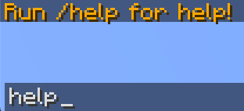

# Chat

Chat depends on the `JsonMessage` class which represents a message in raw JSON. JsonMessages take the form of `ColoredText` and `RichMessage` as described below.

Both forms of JSON message make use of `ChatColor` for coloring text. ChatColor can be used as an enum of the legacy colors, but can also generate any RGB color \(in modern Minecraft versions\):

```java
ChatColor.LIGHT_GREEN

ChatColor.fromRGB(byte, byte, byte);

// For example (absolute red)
ChatColor.fromRGB((byte) 255, (byte) 0, (byte) 0);
```

## ColoredText

The most basic form of text is `ColoredText`. It represents a basic string of text with a color:

```java
ColoredText white = ColoredText.of("Uncolored (white) text.");
ColoredText green = ColoredText.of(ChatColor.BRIGHT_GREEN, "Green text!");
ColoredText colors = ColoredText.of(ChatColor.CYAN + "I am " + 
                                ChatColor.YELLOW + "multi colored!"));

ColoredText christmas = ColoredText.of(ChatColor.BRIGHT_GREEN, "Merry ")
        .append(ChatColor.RED, "Christmas")
        .append("!");
```

The final example would render as follows:


## RichMessage

RichMessage provides a way to send chat components that contain events.

They are based on ColoredText, and can be created using a ColoredText instance:

```java
RichMessage base = RichMessage.of(white);
```

Once you have a RichMessage, you may add events as you see fit. A short description of the existing methods to add events can be found below. For a more complete explanation, see the [wiki.vg chat reference](https://wiki.vg/Chat).

The event methods \(`RichMessage#setHoverEvent` and `RichMessage#setClickEvent`\) add an event to the most recently appended piece of text. For example, if I want to create a component which has a different hover effect on the first and second part, it can be done as follows:

```java
RichMessage message = RichMessage.of(ColoredText.of(ChatColor.RED, "Hello, "))
        .setHoverEvent(someHoverEvent)
        .append(ColoredText.of(ChatColor.BLUE, "World"))
        .setHoverEvent(someOtherHoverEvent);
```

The result will be the text "Hello, World" with someHoverEvent on "Hello, ", and someOtherHoverEvent on "World".

**Hover Events**

Hover events can be created using static methods and applied to a RichMessage as follows:

```java
ChatHoverEvent.showEntity(Entity);
ChatHoverEvent.showItem(ItemStack);
ChatHoverEvent.showText(JsonMessage);

RichMessage#setHoverEvent(ChatHoverEvent);

// For example
RichMessage question = RichMessage.of(ColoredText.of(ChatColor.GRAY, "Which animal meows?"))
        .setHoverEvent(ChatHoverEvent.showText(ColoredText.of(ChatColor.YELLOW, "Cats")));
```

The example renders as follows:


**Click Events**

Click events can be created and applied similarly:

```java
ChatClickEvent.openUrl(String)
// Note, command strings should not start with a /
ChatClickEvent.suggestCommand(String)
ChatClickEvent.runCommand(String)

RichMessage#setClickEvent(ChatClickEvent);

// For example
RichMessage help = RichMessage.of(ColoredText.of(ChatColor.GOLD, "Run /help for help!"))
        .setClickEvent(ChatClickEvent.suggestCommand("help"));
```

The example renders as follows \(after clicking it\):



## Extending the Chat API

The chat API is built on top of JsonMessage. JsonMessage represents the raw JSON version of a send-able piece of text. JsonMessage can be used anywhere that supports JSON chat, so conversion from other chat libraries only has to convert to raw JSON.

To create a JsonMessage from raw JSON, simply instantiate a new `RawJsonMessage` given a \(Gson\) `JsonObject`:

```java
JsonMessage message = new JsonMessage.RawJsonMessage(someJsonObject);
```

